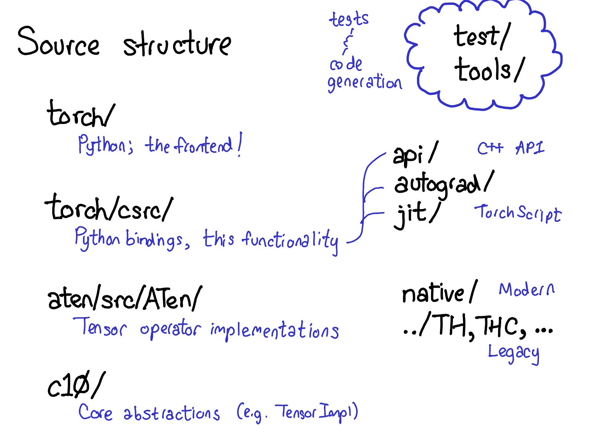
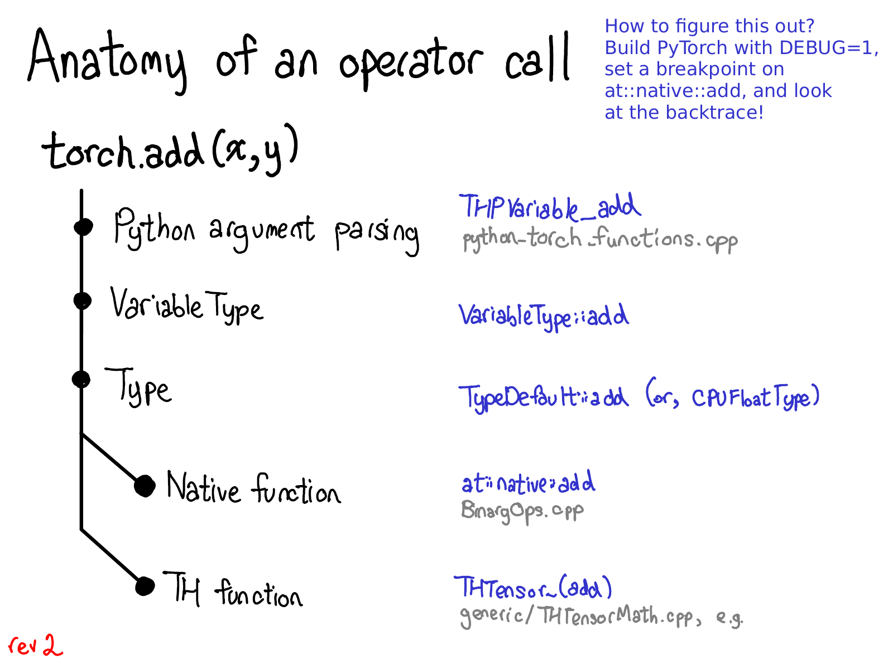
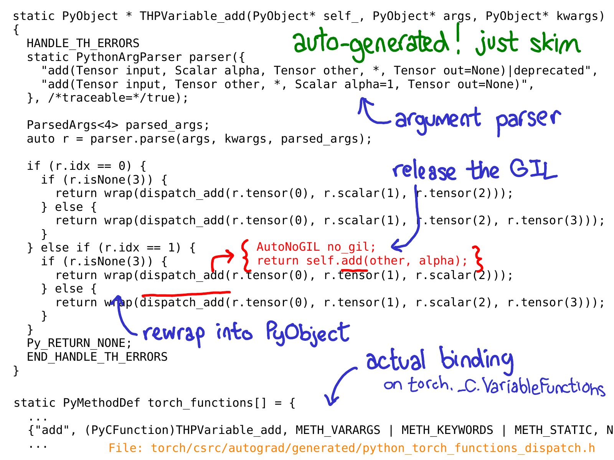

# PyTorch 代码结构

PyTorch 有很多文件夹，[CONTRIBUTING 文档](https://github.com/pytorch/pytorch/blob/master/CONTRIBUTING.md#codebase-structure)中对它们的功能有非常详细的描述，但其实你只需要了解四个目录：

- 首先， `torch/` 包含你最熟悉的部分：你导入并使用的实际 Python 模块。这些都是 Python 代码，很容易进行修改（只需做出改变，看看会发生什么）。然而，在表面之下不远处……
- `torch/csrc/` ，实现了你可能称之为 PyTorch 前端的 C++代码。更具体地说，它实现了在 Python 和 C++之间进行转换的绑定代码，并且还包含了一些非常重要的 PyTorch 组件，比如自动求导引擎和 JIT 编译器。此外，它还包含了 C++前端代码。
- `aten/` ，简称“张量库”（由 Zachary DeVito 提出），是 C++库，实现了张量的算子。如果你在寻找某些内核代码的位置，很可能就在 ATen 中。ATen 本身分为两个操作区域：“原生”算子，即现代的 C++ 实现；以及“遗留”算子（TH、THC、THNN、THCUNN），即过时的 C 语言实现。“遗留”算子是不那么理想的区域；如果可以的话，尽量不要在那里花费太多时间。
- `c10/` 这个名字是对 Caffe2 和 A"Ten"（你能想到吗？Caffe 10）的一种双关，包含了 PyTorch 的核心抽象，包括 Tensor 和 Storage 数据结构的实际实现。

查找代码的地方很多；可能应该简化目录结构，但就是这样。如果你打算修改算子，你将大部分时间花在 `aten` 上。

看看这种代码分离在实践中是如何实现的：

当你调用像 torch.add 这样的函数时，实际上发生了什么？如果你还记得关于分发的讨论，你已经在脑海中有了基本的画面：

- 必须从 Python 领域转换到 C++领域（Python 参数解析）
- 处理变量分发（顺便说一下，Type 实际上与编程语言类型无关，只是一个进行分发的工具。）
- 处理设备类型/布局分发（Type）
- 有实际的内核，它可以是现代本地函数，也可以是遗留的 TH 函数。

每一步都对应着具体的代码。

C++ 代码的初始入口点是 Python 函数的 C 实现，在 Python 侧将其暴露为类似于 `torch._C.VariableFunctions.add` 的形式。 THPVariable_add 是此类实现之一的实现。

了解这段代码的一个重要事项是，它是自动生成的。如果你在 GitHub 仓库中搜索，是找不到它的，因为只有真正构建 PyTorch 才能看到。另一个重要事项是，你不需要真正深入理解这段代码的具体作用；主要是快速浏览一下，大致了解它的功能。上面，我用蓝色标注了一些最重要的部分：你可以看到这里使用了类 PythonArgParser 来从 Python 的 args 和 kwargs 中提取 C++ 对象；然后调用了一个 dispatch_add 函数（我用红色内联显示了该函数）；这会释放全局解释器锁，然后在 C++ 张量 self 上调用一个普通的旧方法。返回途中，我们将返回的 Tensor 重新包装成一个 PyObject 。