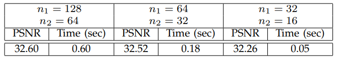
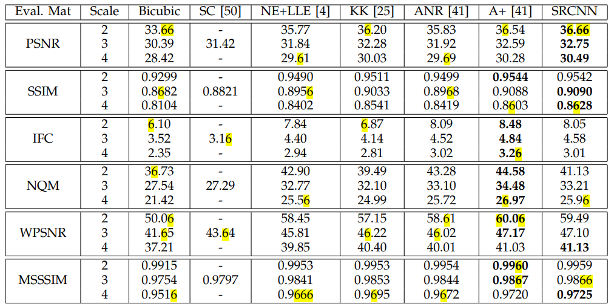
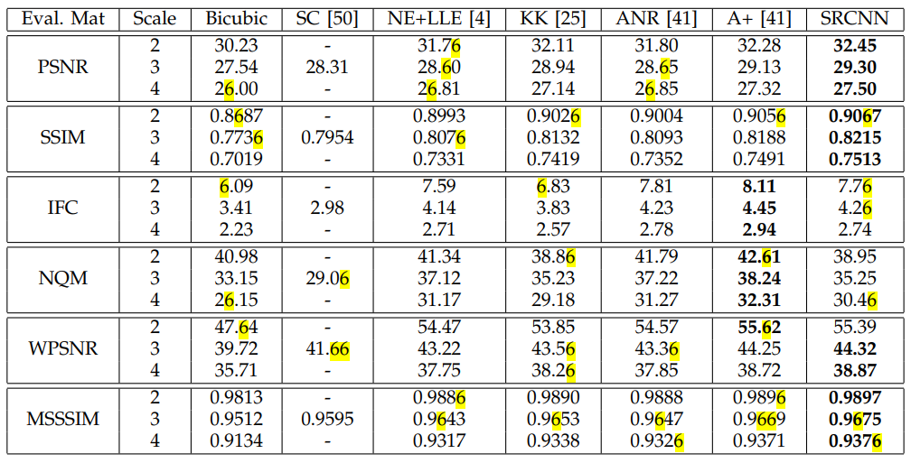
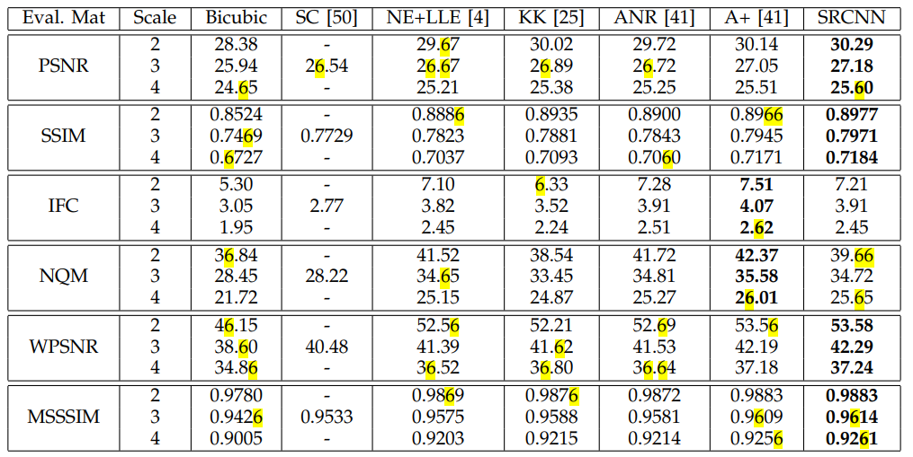
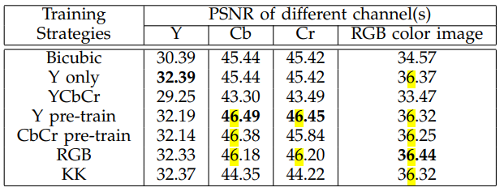

# SRCNN 论文阅读

```{topic} 来源
- [Image Super-Resolution Using Deep Convolutional Networks](https://mmlab.ie.cuhk.edu.hk/projects/SRCNN.html)
- [Caffe 源码](https://mmlab.ie.cuhk.edu.hk/projects/SRCNN/SRCNN_train.zip)
- {cite:t}`dong2015imagesuperresolutionusingdeep`
```

## 摘要

本文提出了一种用于单幅图像超分辨率（SR）的深度学习方法。本文的方法直接学习低分辨率和高分辨率图像之间的端到端映射。该映射被表示为深度卷积神经网络（CNN），它以低分辨率图像作为输入，并输出高分辨率图像。进一步研究表明，传统的基于稀疏编码的 SR 方法也可以被视为深度卷积网络。但与传统方法分别处理每个组件不同，本文的方法联合优化所有层。本文的深度 CNN 具有轻量级结构，但展示了最先进的恢复质量，并在实际在线使用中实现了快速速度。本文探索了不同的网络结构和参数设置，以在性能和速度之间取得平衡。此外，本文将网络扩展到同时处理三个颜色通道，并展示了更好的整体重建质量。

所提出的超分辨率卷积神经网络（SRCNN）在仅经过几次训练迭代后，就超越了双三次插值基线，并且在适度训练后优于基于稀疏编码的方法（SC）。通过更多的训练迭代，性能可能会进一步提高。

## 1 引言

单幅图像超分辨率（SR）旨在从单幅低分辨率图像中恢复高分辨率图像，是计算机视觉中的经典问题。由于对于任何给定的低分辨率像素都存在多种解决方案，因此这个问题本质上是不适定的(ill-posed)。换句话说，它是欠定的反问题(underdetermined inverse problem)，其解不是唯一的。通常通过强先验信息约束解空间来缓解这个问题。为了学习先验信息，最近的最先进方法大多采用基于示例的策略。这些方法要么利用同一图像的内部相似性，要么从外部低分辨率和高分辨率示例对中学习映射函数。基于外部示例的方法可以针对通用图像超分辨率进行建模，也可以根据提供的训练样本设计为适合特定领域任务，例如人脸幻觉。

基于稀疏编码的方法是代表性的基于外部示例的 SR 方法之一。该方法在其解决方案流程中涉及几个步骤。首先，从输入图像中密集地裁剪重叠的图像块，并进行预处理（例如，减去均值和归一化）。然后，这些图像块通过低分辨率字典进行编码。稀疏系数随后传递到高分辨率字典中，以重建高分辨率图像块。重叠重建的图像块通过（例如，加权平均）聚合以生成最终输出。大多数基于外部示例的方法都共享这一流程，特别关注于学习与优化字典或构建高效的映射函数。然而，流程中的其余步骤很少在统一的优化框架中进行优化或考虑。

在本文展示了上述流程等价于深度卷积神经网络（更多细节见第3.2节）。受此启发，考虑直接学习低分辨率和高分辨率图像之间端到端映射的卷积神经网络。本文的方法与现有的基于外部示例的方法有根本区别，因为本文的方法不显式地学习字典或流形来建模图像块空间。这些是通过隐藏层隐式实现的。此外，图像块提取和聚合也被表述为卷积层，因此也参与了优化。在本文的方法中，整个 SR 流程通过学习完全获得，几乎没有预处理或后处理。

本文将提出的模型命名为超分辨率卷积神经网络（SRCNN）[^1]。所提出的 SRCNN 具有几个吸引人的特性。首先，其结构设计简洁，但与最先进的基于示例的方法相比，提供了更高的准确性[^2]。其次，在适度的滤波器和层数下，即使在 CPU 上也能实现快速的实际在线使用速度。本文的方法比许多基于示例的方法更快，因为它完全是前馈的，在使用时不需要解决任何优化问题。第三，实验表明，当（i）更大和更多样化的数据集可用，和/或（ii）使用更大和更深的模型时，网络的恢复质量可以进一步提高。相反，更大的数据集/模型对现有的基于示例的方法提出了挑战。此外，所提出的网络可以同时处理彩色图像的三个通道，以实现改进的超分辨率性能。

总的来说，本研究的主要贡献主要在三个方面：
1. 提出了一种用于图像超分辨率的完全卷积神经网络。该网络直接学习低分辨率和高分辨率图像之间的端到端映射，除了优化之外几乎没有预处理或后处理。
2. 建立了基于深度学习的 SR 方法与传统的基于稀疏编码的 SR 方法之间的关系。这种关系为网络结构的设计提供了指导。
3. 证明了深度学习在经典的计算机视觉问题——超分辨率中的有效性，并且可以实现良好的质量和速度。

这项工作的初步版本之前已经发表 {cite:t}`dong2015imagesuperresolutionusingdeepv1`。当前的工作在初始版本的基础上有了显著的补充。首先，通过在非线性映射层引入更大的滤波器尺寸，并探索通过添加非线性映射层来加深结构，从而改进了 SRCNN。{numref}`fig1` 展示了示例的比较。其次，将 SRCNN 扩展到同时处理三个颜色通道（在 YCbCr 或 RGB 颜色空间中）。实验上，证明了与单通道网络相比，性能可以得到提升。第三，对初始结果增加了大量的新分析和直观的解释。还从 [Set5](https://paperswithcode.com/dataset/set5) 和[Set14](https://paperswithcode.com/dataset/set14)测试图像扩展到 BSD200（200张测试图像）。此外，与许多最近发表的方法进行了比较，并确认模型在使用不同评估指标时仍然优于现有方法。

[^1]: 实现代码可在 <http://mmlab.ie.cuhk.edu.hk/projects/SRCNN.html> 获取。

[^2]: 当存在真实图像时，使用不同的评估指标（如峰值信噪比（PSNR）、结构相似性指数（SSIM）[43]、多尺度SSIM[44]、信息保真度准则[38]）进行数值评估。

```{figure} images/fig1.png
---
name: fig1
---
所提出的超分辨率卷积神经网络（SRCNN）在仅经过几次训练迭代后就超过了双三次基线，并在适度训练后优于基于稀疏编码的方法（SC）[50]。通过更多训练迭代，性能可能会进一步提高。更多细节在第4.4.1节提供（Set5数据集，放大因子为3）。所提出的方法提供了视觉上吸引人的重建图像。
```

## 2 相关工作

### 2.1 图像超分辨率

根据图像先验，单幅图像超分辨率算法可以分为四类——预测模型、基于边缘的方法、图像统计方法和基于图像块（或基于示例）的方法。这些方法在 Yang 等人的工作中得到了彻底的研究和评估。其中，基于示例的方法达到了最先进的性能。

基于内部示例的方法利用自相似性属性，并从输入图像生成示例图像块。Glasner的工作首次提出，并提出了几种改进的变体以加速实现。基于外部示例的方法从外部数据集中学习低分辨率和高分辨率图像块之间的映射。这些研究在如何学习紧凑的字典或流形空间以关联低分辨率和高分辨率图像块，以及如何在这样空间中进行表示方案方面有所不同。在Freeman等人的开创性工作中，字典直接表示为低分辨率和高分辨率图像块对，并在低分辨率空间中找到输入图像块的最近邻（NN），使用其对应的高分辨率图像块进行重建。Chang等人引入流形嵌入技术作为NN策略的替代方案。在Yang等人的工作中，上述NN对应关系进一步发展为更复杂的稀疏编码公式。其他映射函数如核回归、简单函数、随机森林和锚定邻域回归被提出以进一步提高映射的准确性和速度。基于稀疏编码的方法及其几种改进是目前最先进的SR方法之一。在这些方法中，图像块是优化的重点；图像块提取和聚合步骤被视为预处理/后处理，并单独处理。

大多数SR算法[2]、[4]、[15]、[41]、[48]、[49]、[50]、[51]专注于灰度或单通道图像超分辨率。对于彩色图像，上述方法首先将问题转换到不同的颜色空间（YCbCr或YUV），然后仅在亮度通道上应用SR。也有一些工作尝试同时超分辨所有通道。例如，Kim和Kwon[25]以及Dai等人[7]将他们的模型应用于每个RGB通道，并将它们组合以产生最终结果。然而，他们都没有分析不同通道的SR性能，以及恢复所有三个通道的必要性。

### 2.2 卷积神经网络
卷积神经网络（CNN）已有数十年的历史[27]，最近由于其在图像分类[18]、[26]中的成功，深度CNN显示出爆炸性的流行。它们也成功应用于其他计算机视觉领域，如目标检测[34]、[40]、[52]、人脸识别[39]和行人检测[35]。这一进展的几个关键因素包括：（i）在现代强大GPU上的高效训练实现[26]，（ii）提出整流线性单元（ReLU）[33]，使得收敛更快，同时仍保持良好质量[26]，以及（iii）易于获取大量数据（如ImageNet[9]）用于训练更大模型。本文的方法也从这些进展中受益。

### 2.3 用于图像恢复的深度学习
已有一些研究使用深度学习技术进行图像恢复。多层感知器（MLP），其所有层都是全连接的（与卷积相反），被应用于自然图像去噪[3]和去模糊后去噪[36]。与本文的工作更相关的是，卷积神经网络被应用于自然图像去噪[22]和去除噪声模式（污垢/雨）[12]。这些恢复问题或多或少都是去噪驱动的。Cui等人[5]提出在他们的超分辨率流程中嵌入自动编码器网络，基于内部示例方法[16]。深度模型并非专门设计为端到端解决方案，因为级联的每一层都需要独立优化自相似性搜索过程和自动编码器。相反，所提出的SRCNN优化了端到端映射。此外，SRCNN在速度上更快。它不仅在定量上是一种优越的方法，而且在实际应用中也是一种有用的方法。

## 3 用于超分辨率的卷积神经网络

### 3.1 公式化

考虑单幅低分辨率图像，首先使用双三次插值将其放大到所需尺寸，这是执行的唯一预处理[^3]。将插值后的图像表示为 $Y$。目标是从 $Y$ 中恢复图像 $F(Y)$，使其尽可能接近真实的高分辨率图像 $X$。为了便于表示，仍然称 $Y$ 为“低分辨率”图像，尽管它与 $X$ 具有相同的大小。希望学习映射 $F$，从概念上讲，它包括三个操作：
1. 图像块提取与表示：此操作从低分辨率图像 $Y$ 中提取（重叠的）图像块，并将每个图像块表示为高维向量。这些向量构成一组特征图，其数量等于向量的维度。
3. 非线性映射：此操作将每个高维向量非线性地映射到另一个高维向量。每个映射后的向量在概念上是高分辨率图像块的表示。这些向量构成另一组特征图。
3. 重建：此操作聚合上述高分辨率图像块的表示，以生成最终的高分辨率图像。该图像应与真实图像 $X$ 相似。

所有这些操作形成一个卷积神经网络。网络的概览如 {numref}`fig2` 所示。接下来详细定义每个操作。

[^3]: 双三次插值也是一种卷积操作，因此可以将其表述为卷积层。然而，该层的输出大小大于输入大小，因此存在分数步幅。为了利用流行的优化实现（如cuda-convnet[26]），将此“层”排除在学习之外。

```{figure} images/fig2.png
---
name: fig2
---
给定低分辨率图像 $Y$，SRCNN 的第一卷积层提取一组特征图。第二层将这些特征图非线性地映射到高分辨率图像块表示。最后一层在空间邻域内组合预测，以生成最终的高分辨率图像 $F(Y)$。
```
#### 3.1.1 图像块提取与表示

在图像恢复中的一种流行策略（例如，[1]）是密集地提取图像块，然后通过一组预训练的基（如 PCA、DCT、Haar 等）来表示它们。这等价于通过一组滤波器对图像进行卷积，每个滤波器都是一个基。在本文的公式中，将这些基的优化纳入网络的优化中。形式上，第一层表示为操作 $F_1$：

$$
F_1(Y) = \max (0, W_1 ∗ Y + B_1)
$$

其中，$W_1$ 和 $B_1$ 分别表示滤波器和偏置，$∗$ 表示卷积操作。这里，$W_1$ 对应于 $n_1$ 个支持 $c \times f_1 \times f_1$ 的滤波器，其中 $c$ 是输入图像的通道数，$f_1$ 是滤波器的空间大小。直观地说，$W_1$ 在图像上应用 $n_1$ 个卷积，每个卷积的核大小为 $c \times f_1 \times f_1$。输出由 $n_1$ 个特征图组成。$B_1$ 是 $n_1$ 维向量，其每个元素与滤波器相关联。在滤波器响应上应用整流线性单元（ReLU，$\max(0, x)$）[33][^4]。

[^4]: ReLU 可以等效地视为第二操作（非线性映射）的一部分，而第一操作（图像块提取与表示）变为纯线性卷积。

#### 3.1.2 非线性映射
第一层为每个图像块提取 $n_1$ 维特征。在第二个操作中，将每个 $n_1$ 维向量映射到 $n_2$ 维向量。这等价于应用 $n_2$ 个空间支持为 $1 \times 1$ 的滤波器。这种解释仅对 $1 \times 1$ 滤波器有效。但很容易推广到更大的滤波器，如 $3 \times 3$ 或 $5 \times 5$。在这种情况下，非线性映射不是在输入图像的图像块上，而是在特征图的 $3 \times 3$ 或 $5 \times 5$ “图像块”上。第二层的操作是：

$$
F_2(Y) = \max (0, W_2 ∗ F_1(Y) + B_2)
$$

这里 $W_2$ 包含 $n_2$ 个大小为 $n_1 \times f_2 \times f_2$ 的滤波器，$B_2$ 是 $n_2$ 维的。每个输出的 $n_2$ 维向量在概念上是高分辨率图像块的表示，将用于重建。
可以添加更多卷积层以增加非线性。但这会增加模型的复杂性（对于一层，有 $n_2 \times f_2 \times f_2 \times n_2$ 个参数），从而需要更多的训练时间。将在第 4.3.3 节通过引入额外的非线性映射层来探索更深的结构。

#### 3.1.3 重建
在传统方法中，预测的重叠高分辨率图像块通常被平均以生成最终的全图像。平均可以被视为在一组特征图（其中每个位置是高分辨率图像块的“展平”向量形式）上的预定义滤波器。受此启发，本文定义一个卷积层来生成最终的高分辨率图像：

$$
F(Y) = W_3 ∗ F_2(Y) + B_3
$$

这里 $W_3$ 对应于大小为 $n_2 \times f_3 \times f_3$ 的c个滤波器，$B_3$ 是 $c$ 维向量。
如果高分辨率图像块的表示在图像域中（即，本文可以简单地重塑每个表示以形成图像块），本文期望滤波器像平均滤波器一样作用；如果高分辨率图像块的表示在其他域中（例如，以某些基的系数表示），期望 $W3$ 的行为像首先将系数投影到图像域，然后进行平均。无论哪种方式，$W_3$ 都是一组线性滤波器。
有趣的是，尽管上述三个操作是由不同的直觉驱动的，但它们都导致与卷积层相同的形式。本文将所有三个操作放在一起，形成一个卷积神经网络（{numref}`fig2`）。在这个模型中，所有滤波器权重和偏置都将被优化。尽管整体结构简洁，但本文的SRCNN模型是通过借鉴超分辨率领域的显著进展[49]、[50]所积累的丰富经验精心开发的。本文在下一节详细阐述这种关系。

### 3.2 与基于稀疏编码的方法的关系

展示了基于稀疏编码的SR方法[49]、[50]可以被视为卷积神经网络。{numref}`fig3`展示了示意图。
在基于稀疏编码的方法中，考虑从输入图像中提取 $f_1 \times f_1$ 的低分辨率图像块。然后，稀疏编码求解器（如Feature-Sign[29]）首先将图像块投影到一个（低分辨率）字典上。如果字典大小为 $n_1$，这等价于在输入图像上应用 $n_1$ 个线性滤波器（$f_1 \times f_1$）（均值减法也是一种线性操作，因此可以被吸收）。这在{numref}`fig3`的左侧部分进行了说明。

```{figure} images/fig3.png
------------
name: fig3
------------
基于稀疏编码的方法在卷积神经网络视角下的示意图。
```

稀疏编码求解器随后将迭代处理这 $n_1$ 个系数。该求解器的输出是 $n_2$ 个系数，通常在稀疏编码的情况下 $n_2 = n_1$。这些 $n_2$ 个系数是高分辨率图像块的表示。从这个意义上说，稀疏编码求解器作为非线性映射算子的一个特例，其空间支持为 $1 \times 1$。参见{numref}`fig3`的中间部分。然而，稀疏编码求解器不是前馈的，即它是一个迭代算法。相反，本文的非线性算子是完全前馈的，并且可以高效计算。如果本文设置 $f_2 = 1$，那么本文的非线性算子可以被视为逐像素的全连接层。值得注意的是，SRCNN中的“稀疏编码求解器”指的是前两层，而不仅仅是第二层或激活函数（ReLU）。因此，SRCNN中的非线性操作也通过学习过程进行了优化。

上述 $n_2$ 个系数（经过稀疏编码后）随后被投影到另一个（高分辨率）字典上，以生成高分辨率图像块。重叠的高分辨率图像块随后被平均。如上所述，这等价于在 $n_2$ 个特征图上的线性卷积。如果用于重建的高分辨率图像块的大小为 $f_3 \times f_3$，那么线性滤波器具有等效的空间支持大小为 $f_3 \times f_3$。参见{numref}`fig3`的右侧部分。
上述讨论表明，基于稀疏编码的SR方法可以被视为一种卷积神经网络（具有不同的非线性映射）。但并非所有操作都在基于稀疏编码的SR方法中进行了优化。相反，在本文的卷积神经网络中，低分辨率字典、高分辨率字典、非线性映射，以及均值减法和平均，都作为要优化的滤波器的一部分。因此，本文的方法优化了一个包含所有操作的端到端映射。
上述类比还可以帮助本文设计超参数。例如，本文可以将最后一层的滤波器大小设置为小于第一层的滤波器大小，从而本文更多地依赖高分辨率图像块的中心部分（极端情况下，如果 $f_3 = 1$，本文使用中心像素而没有平均）。本文也可以设置 $n_2 \lt n_1$，因为预期它会更稀疏。一个典型的基本设置是 $f_1 = 9$，$f_2 = 1$，$f_3 = 5$，$n_1 = 64$，$n_2 = 32$（本文在实验部分评估更多设置）。总体而言，高分辨率像素的估计利用了 $(9 + 5 − 1)^2 = 169$ 个像素的信息。显然，用于重建的信息比现有基于外部示例的方法（例如，使用 $(5 + 5 − 1)^2 = 81$[^5] 个像素[15]、[50]）所利用的信息更大。这是SRCNN性能优越的原因之一。

[^5]: 图像块在每个方向上重叠4个像素。

### 3.3 训练

学习端到端映射函数F需要估计网络参数 $\Theta = \{W_1, W_2, W_3, B_1, B_2, B_3\}$。这是通过最小化重建图像 $F(Y; \Theta)$ 与相应的高分辨率真实图像 $X$ 之间的损失来实现的。给定一组高分辨率图像 $\{X_i\}$ 及其对应的低分辨率图像 $\{Y_i\}$，本文使用均方误差（MSE）作为损失函数：

$$
L(\Theta) = \frac{1}{n} \sum_{i=1}^n ||F(Y_i; \Theta) − X_i||^2
$$

其中 $n$ 是训练样本的数量。使用 MSE 作为损失函数有利于高 PSNR。PSNR 是定量评估图像恢复质量的广泛使用的指标，至少与感知质量部分相关。值得注意的是，卷积神经网络并不排除使用其他类型的损失函数，只要损失函数是可导的。如果在训练期间给出了更好的感知驱动的指标，网络可以灵活地适应该指标。相反，这种灵活性对于传统的“手工设计”方法来说通常是难以实现的。尽管提出的模型在训练时倾向于高PSNR，但本文仍然观察到在使用其他评估指标（例如，SSIM、MSSIM）进行评估时，模型表现令人满意（见第4.4.1节）。

损失通过使用标准反向传播[28]的随机梯度下降来最小化。特别地，权重矩阵更新如下：

$$
\Delta_{i+1} = 0.9 \cdot \Delta_i − \eta \cfrac{\partial L}{\partial W_i^{\ell}}, W_{i+1}^{\ell} = W_i^{\ell} + \Delta_{i+1}
$$

其中 $\ell \in \{1, 2, 3\}$ 和 $i$ 是层和迭代的索引，$\eta$ 是学习率，$\cfrac{\partial L}{\partial W_i^{\ell}}$ 是导数。每层的滤波器权重从均值为零、标准差为 $0.001$ 的高斯分布中随机抽取（偏置为 $0$）。前两层的学习率为 $10^{−4}$，最后一层的学习率为$10^{−5}$。经验性地发现，最后一层较小的学习率对网络收敛很重要（类似于去噪情况[22]）。

在训练阶段，真实图像 $\{X_i\}$ 被准备为从训练图像中随机裁剪的 $f_{\text{sub}} \times f_{\text{sub}} \times c$ 像素的子图像。所说的“子图像”是指这些样本被视为小的“图像”，而不是“图像块”(patches)，因为“图像块”是重叠的，需要一些后处理平均，但“子图像”不需要。为了合成低分辨率样本 $\{Y_i\}$，通过高斯核模糊子图像，按放大因子对其进行下采样，并通过双三次插值按相同因子进行上采样。

为了避免训练期间的边界效应，所有卷积层都没有填充，网络产生较小的输出 $((f_{\text{sub}} − f_1 − f_2 − f_3 + 3)^2 \times c)$。MSE 损失函数仅通过 $X_i$ 的中心像素与网络输出的差异进行评估。尽管在训练中使用固定的图像大小，但在测试期间卷积神经网络可以应用于任意大小的图像。
使用cuda-convnet包[26]实现本文的模型。也尝试了Caffe包[24]，并观察到类似的性能。

## 4 实验

首先研究使用不同数据集对模型性能的影响。接下来，检查学到的滤波器。然后，探索网络的不同架构设计，并研究超分辨率性能与深度、滤波器数量和滤波器大小等因素之间的关系。随后，通过定量和定性的方式与最近的最先进方法进行比较。根据[42]，超分辨率仅应用于亮度通道（YCbCr颜色空间中的Y通道）在第4.1-4.4节中，因此第一层/最后一层的 $c = 1$，并且性能（例如，PSNR 和 SSIM）在 Y 通道上进行评估。最后，将网络扩展到处理彩色图像，并在不同通道上评估性能。

### 4.1 训练数据

如文献所示，深度学习通常受益于大数据训练。为了比较，使用了相对较小的训练集[41]、[50]，该训练集由 $91$ 张图像组成，以及由 ILSVRC 2013 ImageNet 检测训练分区中的 $395\,909$ 张图像组成的大训练集。训练子图像的大小为 $f_{\text{sub}} = 33$。因此，$91$ 图像数据集可以分解为 $24\,800$ 个子图像，这些子图像从原始图像中以 $14$ 的步幅提取。而 ImageNet 即使使用 $33$ 的步幅也提供了超过 $500$ 万个子图像。使用基本网络设置，即$f_1 = 9, f_2 = 1, f_3 = 5, n_1 = 64, n_2 = 32$。使用Set5 [2]作为验证集。即使使用更大的 Set14 集[51]，也观察到类似的趋势。放大因子为 $3$。使用基于稀疏编码的方法[50]作为基线，其平均 PSNR 值为 31.42 dB。

使用不同训练集的测试收敛曲线如 {numref}`fig4` 所示。在 ImageNet 上的训练时间与在 $91$ 图像数据集上的训练时间大致相同，因为反向传播的次数相同。如观察到的，在相同的反向传播次数（即 $8 \times 108$）下，使用 ImageNet 训练的 SRCNN+ImageNet 达到 **32.52 dB**，高于使用 $91$ 图像训练的 SRCNN 的 32.39 dB。结果积极表明，使用更大的训练集可能会进一步提高 SRCNN 的性能，但大数据的效果不如在高级视觉问题[26]中显示的那样显著。这主要是因为 $91$ 张图像已经捕捉到了自然图像的足够多样性。另一方面，SRCNN 是相对较小的网络（$8\,032$ 个参数），无法对 $91$ 张图像（$24\,800$ 个样本）进行过拟合。尽管如此，在以下实验中采用包含更多多样数据的 ImageNet 作为默认训练集。

```{figure} images/fig4.png
-------------
name: fig4
-------------
使用更大的 ImageNet 数据集进行训练比使用 $91$ 张图像提高了性能。
```

### 4.2 用于超分辨率的学习滤波器

{numref}`fig5` 展示了通过放大因子 3 在 ImageNet 上训练的第一层滤波器的示例。请参考本文发布的实现以获取放大因子2和4的滤波器。有趣的是，每个学习到的滤波器都有其特定的功能。例如，滤波器 g 和 h 类似于拉普拉斯/高斯滤波器，滤波器 a-e 类似于不同方向的边缘检测器，滤波器 f 类似于纹理提取器。不同层的示例特征图如 {numref}`fig6` 所示。显然，第一层的特征图包含不同的结构（例如，不同方向的边缘），而第二层的特征图主要在强度上不同。

### 4.3 模型与性能的权衡

基于基本网络设置（即 $f_1 = 9, f_2 = 1, f_3 = 5, n_1 = 64, n_2 = 32$，将逐步修改这些参数中的一些，以调查性能与速度之间的最佳权衡，并研究性能与参数之间的关系。

```{figure} images/fig5.png
-------
name: fig5
--------
该图展示了通过放大因子 3 在 ImageNet 上训练的第一层滤波器。滤波器根据其各自的方差进行组织。
```

```{figure} images/fig6.png
-------
name: fig6
--------
不同层的样本特征图。
```

#### 4.3.1 滤波器数量

一般来说，如果增加网络宽度[^6]，即添加更多滤波器，性能会提高，但运行时间会增加。具体来说，基于本文的网络默认设置 $n_1 = 64$ 和 $n_2 = 32$，进行了两个实验：（i）一个是具有更大网络 $n_1 = 128$ 和 $n_2 = 64$，（ii）另一个是具有更小网络 $n_1 = 32$ 和 $n_2 = 16$。与第 4.1 节类似，也在 ImageNet 上训练这两个模型，并在 Set5 上进行测试，放大因子为 3。在 $8 \times 108$ 次反向传播时观察到的结果如 {numref}`tab1` 所示。显然，通过增加宽度可以实现更好的性能。然而，如果需要快速的恢复速度，则首选较小的网络宽度，这仍然可以实现比基于稀疏编码的方法（31.42 dB）更好的性能。

```{table} 使用不同滤波器数量的 SRCNN 结果
:name: tab1

|训练在 ImageNet 上进行，评估在 Set5 数据集上进行。| 
|---|
| |
```

[^6]: 使用“宽度”来表示层中的滤波器数量，遵循[17]。在文献中，“宽度”可能有其他含义。

#### 4.3.2 滤波器大小

在本节中，研究网络对不同滤波器大小的敏感性。在前面的实验中，设置滤波器大小 $f_1 = 9$，$f_2 = 1$ 和 $f_3 = 5$，网络可以表示为 `9-1-5`。首先，为了与基于稀疏编码的方法保持一致，本文将第二层的滤波器大小固定为 $f_2 = 1$，并将其他层的滤波器大小扩大到 $f_1 = 11$ 和 $f_3 = 7$（`11-1-7`）。所有其他设置与第4.1节相同。在Set5上放大因子为3的结果为 32.57 dB，略高于第4.1节中报告的 32.52 dB。这表明，合理更大的滤波器大小可以捕捉更丰富的结构信息，从而导致更好的结果。

```{figure} images/fig7.png
:name: fig7
更大的滤波器大小导致更好的结果。
```

然后，进一步研究具有更大第二层滤波器大小的网络。具体来说，固定滤波器大小 $f_1 = 9$，$f_3 = 5$，并将第二层的滤波器大小扩大到（i）$f_2 = 3$（`9-3-5`）和（ii）$f_2 = 5$（`9-5-5`）。{numref}`fig7` 中的收敛曲线显示，使用更大的滤波器大小可以显著提高性能。具体来说，在Set5上进行 $8 \times 108$ 次反向传播时，`9-3-5` 和 `9-5-5` 的平均 PSNR 值分别为 32.66 dB 和 32.75 dB。结果表明，在映射阶段利用邻域信息是有益的。

然而，部署速度也会随着滤波器大小的增加而降低。例如，`9-1-5`、`9-3-5` 和 `9-5-5` 的参数数量分别为 $8\,032$、$24\,416$ 和 $57\,184$。`9-5-5` 的复杂度几乎是 `9-3-5` 的两倍，但性能提升是微小的。因此，网络规模的选择应始终在性能和速度之间进行权衡。

#### 4.3.3 层数

He和Sun的最新研究[17]表明，CNN可以通过适度增加网络深度而受益。在这里，通过添加另一个非线性映射层来尝试更深的结构，该层有 $n_{22} = 16$ 个滤波器，大小为 $f_{22} = 1$。进行了三个对照实验，即 `9-1-1-5`、`9-3-1-5`、`9-5-1-5`，分别在 `9-1-5`、`9-3-5` 和 `9-5-5` 上添加额外的层。额外层的初始化方案和学习率与第二层相同。从图13(a)、13(b)和8(c)中，可以观察到四层网络比三层网络收敛得更慢。然而，给定足够的训练时间，更深的网络最终会赶上并收敛到三层网络。

```{figure} images/fig8.png
:name: fig8
三层和四层网络之间的比较
```

超分辨率更深结构的有效性不如图像分类[17]中显示的那样明显。此外，发现更深的网络并不总是导致更好的性能。具体来说，如果在 `9-1-5` 网络上添加额外的层，有 $n_{22} = 32$ 个滤波器，那么性能会下降，并且无法超越三层网络（见{numref}`fig9`(a)）。如果通过在 `9-1-5` 上添加两个非线性映射层，有 $n_{22} = 32$ 和 $n_{23} = 16$ 个滤波器，那么必须设置较小的学习率以确保收敛，但在一周的训练后本文仍然没有观察到更好的性能（见{numref}`fig9`(a)）。还尝试将额外层的滤波器大小扩大到 $f_{22} = 3$，并探索两种深层结构——`9-3-3-5` 和 `9-3-3-3`。然而，从图{numref}`fig9`(b)中显示的收敛曲线来看，这两个网络的结果并不比 `9-3-1-5` 网络更好。

```{figure} images/fig9.png
:name: fig9
更深的结构并不总是导致更好的结果。
```

所有这些实验表明，对于超分辨率的深度模型来说，“越深越好”并不成立。这可能是由于训练的困难造成的。本文的CNN网络不包含池化层或全连接层，因此对初始化参数和学习率敏感。当本文加深网络（例如，4或5层）时，本文发现很难设置适当的学习率以保证收敛。即使收敛了，网络也可能陷入不好的局部最小值，即使在足够的训练时间下，学习到的滤波器也缺乏多样性。这种现象在[16]中也观察到，其中不适当的深度增加会导致图像分类的准确性饱和或下降。为什么“更深并不更好”仍然是开放的问题，需要进一步研究以更好地理解深度架构中的梯度和训练动态。因此，在以下实验中仍然采用三层网络。

### 4.4 与最先进方法的比较

在本节中，展示了本文的方法与最先进方法在定量和定性结果上的比较。采用了具有良好性能-速度权衡的模型：三层网络，$f_1 = 9$，$f2 = 5$，$f_3 = 5$，$n_1 = 64$，$n_2 = 32$，在 ImageNet 上训练。对于每个放大因子 $\in \{2, 3, 4\}$，本文为该因子训练特定的网络[^7]。

SRCNN 与最先进的 SR 方法进行比较：
- SC - Yang等人的基于稀疏编码的方法[50]
- NE+LLE - 邻域嵌入+局部线性嵌入方法[4]
- ANR - 锚定邻域回归方法[41]
- A+ - 调整后的锚定邻域回归方法[42]
- KK - [25]中描述的方法，根据Yang等人的工作[46]中的综合评估，在外部示例方法中表现最佳
所有实现均来自作者提供的公开代码，所有图像均使用相同的双三次核进行下采样。
测试集。Set5 [2]（5张图像）、Set14 [51]（14张图像）和BSD200 [32]（200张图像）[^8]用于评估放大因子2、3和4的性能。
评估指标。除了广泛使用的PSNR和SSIM [43]指数外，本文还采用了另外四个评估矩阵，即信息保真度准则（IFC）[38]、噪声质量测量（NQM）[8]、加权峰值信噪比（WPSNR）和多尺度结构相似性指数（MSSSIM）[44]，这些指标与人类感知评分高度相关，如[46]中所报告。

[^7]: 在去噪领域[3]，对于每个噪声级别，训练一个特定的网络。

[^8]: 使用与[46]中相同的 200 张图像。

```{figure} images/fig10.png
:name: fig10
SRCNN的测试收敛曲线以及 Set5 数据集上其他方法的结果。
```

#### 4.4.1 定量和定性评估

如表 {numref}`tab2`、{numref}`tab3` 和 {numref}`tab4` 所示，所提出的 SRCNN 在所有实验中的大多数评估矩阵中取得了最高分数[^9]。请注意，SRCNN结果基于 $8 \times 108$ 次反向传播的检查点。具体来说，对于放大因子3，SRCNN 在三个数据集上比次佳方法A+ [42]的平均PSNR增益分别为0.15 dB、0.17 dB和0.13 dB。当查看其他评估指标时，惊讶地发现SC在IFC和NQM上的得分甚至低于双三次插值。显然，SC的结果在视觉上比双三次插值更令人满意。这表明这两个指标可能无法真实反映图像质量。因此，无论这两个指标如何，SRCNN在所有方法和缩放因子中都取得了最佳性能。

[^9]: 每张图像的 PSNR 值可以在补充文件中找到。

值得一提的是，SRCNN 在学习阶段的开始就超过了双三次基线（见 {numref}`fig1`），并且在适度训练后，SRCNN优于现有的最先进方法（见{numref}`fig4`）。然而，性能远未收敛。本文推测，如果给予更长的训练时间，可以获得更好的结果（见 {numref}`fig10`）。

::::{dropdown}

```{table} Set5数据集上的平均PSNR（dB）、SSIM、IFC、NQM、WPSNR（dB）和MSSIM结果
:name: tab2

|| 
|---|
| |
```

```{table} Set14数据集上的平均PSNR（dB）、SSIM、IFC、NQM、WPSNR（dB）和MSSIM结果
:name: tab3

|| 
|---|
| |
```

```{table} BSD200数据集上的平均PSNR（dB）、SSIM、IFC、NQM、WPSNR（dB）和MSSIM结果
:name: tab4

|| 
|---|
| |
```
```{table} Set5数据集上不同通道和训练策略的平均PSNR（dB）。
:name: tab5

|| 
|---|
| |
```
::::

{numref}`fig14`、{numref}`fig15` 和 {numref}`fig16` 展示了通过放大因子3的不同方法的超分辨率结果。可以看出，SRCNN 生成的边缘比其他方法更锐利，图像中没有任何明显的伪影。

此外，报告了Cui等人的另一种最近用于图像超分辨率的深度学习方法（DNC）[5]。由于他们使用了不同的模糊核（标准差为0.55的高斯滤波器），使用与DNC相同的模糊核训练了特定的网络（`9-5-5`），以进行公平的定量比较。放大因子为3，训练集为91图像数据集。从 {numref}`fig11` 中显示的收敛曲线可以看出，SRCNN在仅2.7 × 107次反向传播后就超过了DNC，并且如果给予更长的训练时间，可以获得更大的差距。这也表明，即使DNC模型已经“深度”，端到端学习也优于 DNC。

::::{dropdown}
```{figure} images/fig11.png
:name: fig11
SRCNN 的测试收敛曲线以及 Set5 数据集上 DNC 的结果。
```

```{figure} images/fig12.png
:name: fig12
所提出的 SRCNN 达到了最先进的超分辨率质量，同时在速度上与现有的基于外部示例的方法相比保持了高竞争力。该图表基于 {numref}`tab3` 中总结的 Set14 结果。所有三个 SRCNN 网络的实现都可以在本文的项目页面上找到。
```

```{figure} images/fig13.png
:name: fig13
使用“Y预训练”策略的第一层滤波器的色度通道。
```

```{figure} images/fig14.png
:name: fig14
来自Set5的“蝴蝶”图像，放大因子为3。
```

```{figure} images/fig15.png
:name: fig15
来自Set14的“ppt3”图像，放大因子为3。
```

```{figure} images/fig16.png
:name: fig16
来自Set14的“斑马”图像，放大因子为3。
```
::::

#### 4.4.2 运行时间

{numref}`fig12` 显示了几种最先进方法的运行时间比较，以及它们在Set14上的恢复性能。所有基线方法均来自相应作者的MATLAB+MEX实现，而本文的方法是纯C++实现。本文在同一台机器（Intel CPU 3.10 GHz和16 GB内存）上对所有算法进行运行时间分析。请注意，本文的方法的处理时间与测试图像分辨率高度线性相关，因为所有图像都经过相同数量的卷积。本文的方法总是在性能和速度之间进行权衡。为了展示这一点，本文训练了三个网络进行比较，分别是 `9-1-5`、`9-3-5` 和 `9-5-5`。显然，`9-1-5` 网络是最快的，同时它的性能仍然优于次佳的A+。其他方法与 `9-1-5` 网络相比，速度慢了几倍甚至几个数量级。请注意，速度差距并非主要由不同的MATLAB/C++实现引起；相反，其他方法在使用时需要解决复杂的优化问题（例如，稀疏编码或嵌入），而本文的方法完全是前馈的。9-5-5网络以运行时间为代价实现了最佳性能。本文的CNN的测试时间速度可以通过多种方式进一步加速，例如近似或简化训练网络[10]、[21]、[31]，可能会导致性能略有下降。

### 4.5 彩色通道实验

在前面的实验中，遵循传统方法对彩色图像进行超分辨率处理。具体来说，首先将彩色图像转换为 YCbCr 空间。SR 算法仅应用于 Y 通道，而 Cb 和 Cr 通道通过双三次插值进行上采样。有趣的是，如果在这个过程中联合考虑所有三个通道，是否可以提高超分辨率性能。

本文的方法可以灵活地接受更多通道，而无需改变学习机制和网络设计。特别是，它可以通过将输入通道设置为 `c = 3`，轻松地同时处理三个通道。在以下实验中，本文探索了彩色图像超分辨率的不同训练策略，并随后在不同通道上评估它们的性能。

```{topic} 实现细节。

训练在91图像数据集上进行，测试在Set5 [2]上进行。网络设置为：`c = 3`，`f1 = 9`，`f2 = 1`，`f3 = 5`，`n1 = 64`，`n2 = 32`。由于已经证明了 SRCNN 在不同尺度上的有效性，这里只评估放大因子3的性能。

比较。与最先进的彩色SR方法——KK [25]进行比较。还尝试了不同的学习策略进行比较：
- Y only：这是本文的基线方法，它是一个仅在亮度通道上训练的单通道（`c = 1`）网络。Cb和Cr通道通过双三次插值进行上采样。
- YCbCr：在YCbCr空间的三个通道上进行训练。
- Y pre-train：首先，为了保证Y通道的性能，本文仅使用Y通道的MSE作为损失来预训练网络。然后本文使用所有通道的MSE来微调参数。
- CbCr pre-train：本文使用Cb和Cr通道的MSE作为损失来预训练网络，然后在所有通道上微调参数。
- RGB：在RGB空间的三个通道上进行训练。
```

结果如表5所示，本文有以下观察结果。(i) 如果本文直接在YCbCr通道上进行训练，结果甚至比双三次插值更差。训练陷入了一个不好的局部最小值，这是由于Y和Cb、Cr通道固有的不同特性。(ii) 如果本文对Y或Cb、Cr通道进行预训练，性能最终会提高，但在彩色图像上仍然不如“Y only”（见表5的最后一列，其中PSNR在RGB颜色空间中计算）。这表明，当在统一的网络中进行训练时，Cb、Cr通道可能会降低Y通道的性能。(iii) 本文观察到，对于“Y pre-train”，Cb、Cr通道的PSNR值高于“CbCr pre-train”。原因在于Cb、Cr通道与Y通道之间的差异。从视觉上看，Cb、Cr通道比Y通道更模糊，因此受下采样过程的影响较小。当本文对Cb、Cr通道进行预训练时，只有少数滤波器被激活。然后在微调过程中，训练很快就会陷入一个不好的局部最小值。另一方面，如果本文对Y通道进行预训练，更多的滤波器将被激活，Cb、Cr通道的性能将被大大提高。图13显示了使用“Y pre-train”的第一层滤波器的Cb、Cr通道，其模式与图5所示的模式有很大不同。(iv) 在RGB通道上进行训练在彩色图像上取得了最佳结果。与YCbCr通道不同，RGB通道之间表现出高度的互相关性。所提出的SRCNN能够利用通道之间的这种自然对应关系进行重建。因此，该模型在Y通道上取得了与“Y only”相当的结果，在Cb、Cr通道上取得了比双三次插值更好的结果。(v) 在KK [25]中，超分辨率分别应用于每个RGB通道。当本文将其结果转换到YCbCr空间时，Y通道的PSNR值与“Y only”相似，但Cb、Cr通道的PSNR值比双三次插值差。结果表明，该算法偏向于Y通道。总的来说，本文的方法在RGB通道上训练取得了比KK和单通道网络（“Y only”）更好的性能。值得注意的是，与单通道网络相比，改进并不显著（即0.07 dB）。这表明Cb、Cr通道在提高性能方面几乎没有帮助。

## 5 结论

本文提出了一种用于单幅图像超分辨率（SR）的新型深度学习方法。本文展示了传统的基于稀疏编码的SR方法可以被重新表述为深度卷积神经网络。所提出的SRCNN方法学习了低分辨率和高分辨率图像之间的端到端映射，除了优化之外几乎没有额外的预处理/后处理。SRCNN具有轻量级结构，其性能优于最先进的方法。本文推测，通过探索更多滤波器和不同的训练策略，可以进一步获得额外的性能。此外，所提出的结构具有简单性和鲁棒性的优点，可以应用于其他低级视觉问题，如图像去模糊或同时SR+去噪。也可以研究网络来处理不同的放大因子。
